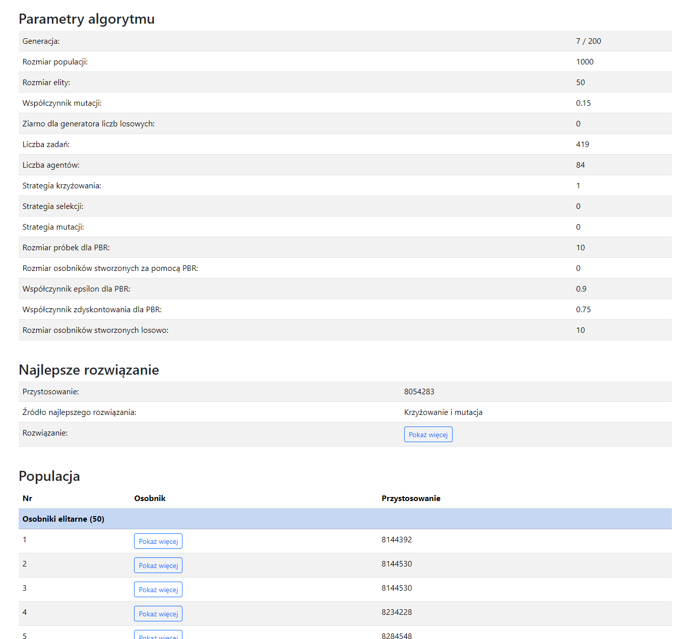

# Bandit Recombination

## Description

Bandit Recombination (BR) is a novel operator for genetic algorithms (GAs). The repository is part of a preliminary study
that verifies its efficiency on a sample benchmark problem.

The repository contains:

-   the standard GA enhanced by BR for the General Assignment Problem (GAP),
-   the GAP datasets taken from [the GAPLIB library](http://astarte.csr.unibo.it/gapdata/gapinstances.html),
-   the runner for the experiments written in PHP (`experiment-runner.php`),
-   the Python script for calculating statistical results (`test.py`),
-   the results of the experiments (`results.ods`).

## Installation

The main program, called `ga_gap`, can be compiled with the standard `g++`. For example, you can use the following command:

```console
g++ --std=c++20 -O2 ga_gap.cpp -o ga_gap.exe
```

For other scripts, PHP 8.3.6 and Python 3.13.3 were used;
however the scripts are very simple so most of PHP and Pythons versions should be suitable.
Additionally, the Python script requires SciPy and NumPy installed.

## Usage

After the compilation, you can use the `ga_gap` as follows:

```console
Usage: ga_gap <input_file> [--population-size <size>] [--elitism-size <size>] [--generations <num>] [--mutation-rate <rate>] [--seed <seed>] [--mutation-strategy <strategy>] [--selection-strategy <strategy>] [--crossover-strategy <strategy>] [--tournament-size <size>] [--pbr-offsprings-size <size>] [--pbr-samples-size <size>] [--pbr-discount-factor <discount_factor>] [--pbr-epsilon <epsilon>] [--random-offsprings-size <size>] [--random-offsprings-by-mutation] [--debug]

```

The descriptions and the default values of the program arguments are depicted in the below table.

| Arguments                     | Optional | Default | Description                                                                                                                                        |
| ----------------------------- | -------- | ------- | -------------------------------------------------------------------------------------------------------------------------------------------------- |
| input_file                    | No       |         | The input GAP dataset in the JSON format.                                                                                                          |
| population-size               | Yes      | 1000    | The population size.                                                                                                                               |
| elitism-size                  | Yes      | 50      | The elitism size.                                                                                                                                  |
| generations                   | Yes      | 200     | The number of generations.                                                                                                                         |
| mutation-rate                 | Yes      | 0.15    | The mutation probability.                                                                                                                          |
| seed                          | Yes      | 0       | The seed. If 0, then will be taken from the current time.                                                                                          |
| mutation-strategy             | Yes      | 0       | 0 = randomly change assignments. 1 = swap randomly two assignments. 2 = randomly change assignments, but keep capacity constraints.                |
| selection-strategy            | Yes      | 0       | 0 = roulette. 1 = tournament. 2 = rank. 3 = random.                                                                                                |
| crossover-strategy            | Yes      | 0       | 0 = one-point. 1 = two-points. 3 = uniform.                                                                                                        |
| tournament-size               | Yes      | 8       | The tournament size.                                                                                                                               |
| pbr-offsprings-size           | Yes      | 0       | The number of individuals generated by BR.                                                                                                         |
| pbr-samples-size              | Yes      | 10      | The number of samples (the best individuals) taken by BR.                                                                                          |
| pbr-discount-factor           | Yes      | 0.75    | The learning rate.                                                                                                                                 |
| pbr-epsilon                   | Yes      | 0.9     | The coefficient for the epsilon-greedy strategy.                                                                                                   |
| random-offsprings-size        | Yes      | 0       | The number of individuals generated randomly in each iteration                                                                                     |
| random-offsprings-by-mutation | Yes      | false   | Change the random generation into mutation from the best individual.                                                                               |
| debug                         | Yes      | false   | Turn on the debug mode. It will pause after each generation and store the current population as JSON. The data can be previewed with `index.html`. |

For reproducibility, the runner script contains all seeds used in the experiments.

To run the debug mode, start the web server (e.g. `php -S localhost:8000`), in either way `index.html` cannot load JSON data. The data are refreshed every second. You should see something like the below screenshot.



## Authors

Contributors names and contact info:

-   [Arkadiusz Nowakowski](https://ab.us.edu.pl/emp?id=46971),
-   [Wojciech Wieczorek](https://kiia.ubb.edu.pl/pracownicy/dr-habwojciechwieczorek),
-   [Łukasz Strąk](https://ab.us.edu.pl/emp?id=47011).
